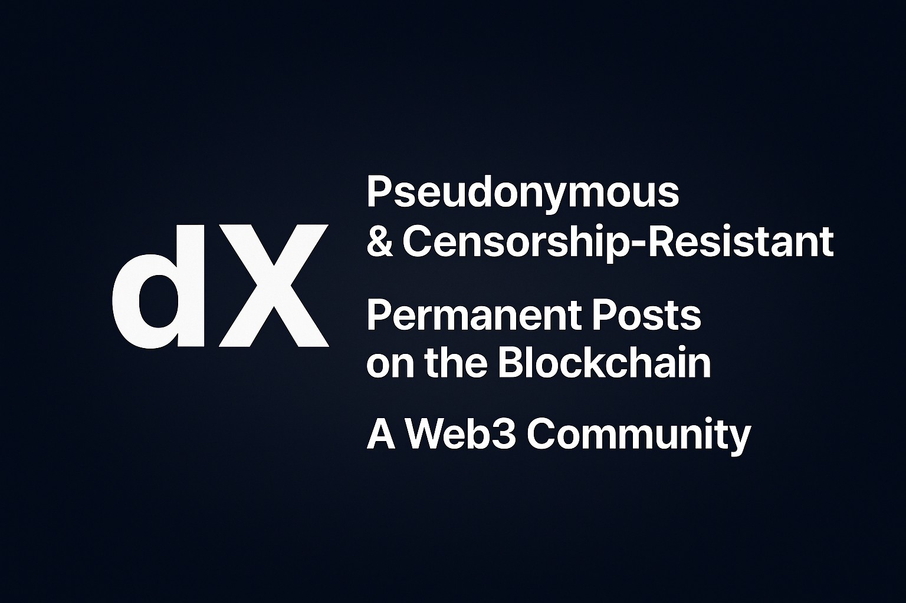

# Introduction

<figure><figcaption></figcaption></figure>

decentralizedX is a censorship-resistant, fully decentralized social media platform that allows anyone to express themselves freely and anonymously — without fear of judgment. Whether you’re curious, seeking advice, or just want to share your thoughts, dX provides a safe and open space for honest conversations. Share anything. Get feedback from the community. All without revealing your identity.

## What makes decentralizedX different from web2 counterpart?

* **Censorship-Resistant**: dX is open to everyone, everywhere, at any time. No one can prevent anyone from posting or commenting. There are no gatekeepers.
* **Anonymity**: No login, no personal data. You don’t need to reveal anything about yourself to participate. Your identity stays yours.
* **Immutability**: Every posts and comments is permanently recorded on the blockchain. Once posted, it cannot be modified or deleted, ensuring transparency and integrity.

