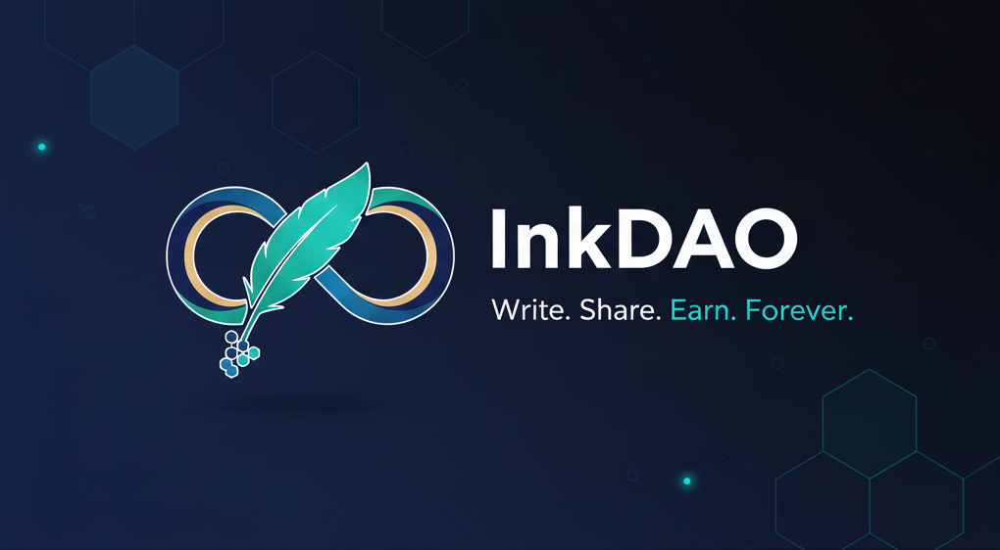

# Introduction

<figure><figcaption></figcaption></figure>

**InkDAO** is a Web3-powered content publishing platform that allows creators to publish high-quality knowledge content and monetize it directly through blockchain technology.  
Built on **Ethereum and IPFS**, InkDAO provides a censorship-resistant and transparent ecosystem where creators truly **own their content, community, and revenue.**

Unlike traditional platforms that control distribution and take large commissions, InkDAO ensures that all ownership and monetization rights remain with the creator. Every piece of content—whether an academic article, trading insight, or premium tutorial—is privately stored on IPFS and publicly verifiable on the blockchain.

### Our Vision  
InkDAO exists to redefine how knowledge creators publish and earn online. It empowers educators, researchers, analysts, and writers to build their own **decentralized knowledge economy**, where expertise becomes a self-sovereign digital asset.

***

## What Makes InkDAO Unique?

* **True Ownership:** Your content lives on IPFS with private access control. Only subscribers receive lifetime access via blockchain-verified ownership, ensuring transparency and security.
* **Direct Monetization:** Set your own price and earn directly. Creators keep **100%** of their revenue, no intermediaries, no platform taking a cut.
* **Wallet-Based Identity:** No signups, emails, or user data. Your wallet address is your secure digital identity, ensuring privacy and authenticity.
* **Decentralized Storage:** All posts are stored on IPFS, guaranteeing permanence, resistance to censorship, and independence from centralized servers.
* **Transparent and Trustless:** Payments, subscriptions, and ownership records are fully verifiable on Ethereum, providing creators and subscribers complete transparency.
* **Rich Content Creation:** The built-in editor supports text, media, code, and embeds, allowing creators to craft deep, interactive reading experiences.

***

## How It Works

1. **Create:** Write and format your content with InkDAO's built-in rich text editor.  
2. **Publish:** Upload securely to IPFS and publish metadata on-chain.  
3. **Monetize:** Choose your own pricing model—free, one-time payment, or community access.  
4. **Earn:** Subscribers pay directly to your wallet and gain lifetime access through on-chain ownership validation.

***

**In essence, InkDAO turns knowledge into on-chain assets.**  
Creators write on their own terms, communities support transparently, and knowledge flows freely—without gatekeepers or censorship.
